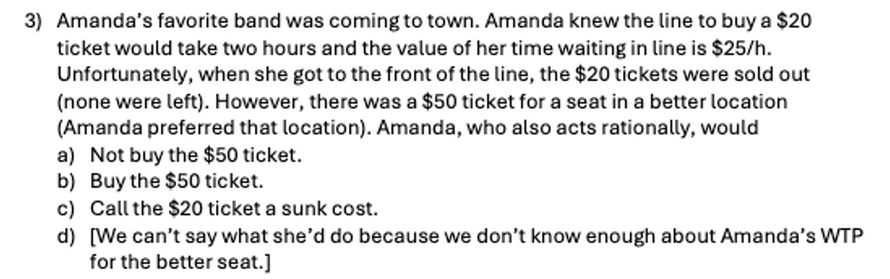

**ECON 1001 — Principles of Microeconomics**  
**Lecture 2 Companion Note**  
**The Amanda Problem: Cost–Benefit Analysis and Opportunity Cost**

2026-01-14  
*David Burk*

---

\vspace{1em}

In Lecture 2, I introduced **the Amanda problem**, a challenging example that requires applying the cost–benefit principle and carefully accounting for costs and benefits.

This note reproduces the problem and then breaks the reasoning into **numbered claims**, so you can see how the conclusion follows step by step—and identify exactly where your own reasoning may have gone off track.

---

**Original problem**

{ width=90% }

---

Amanda *is at the front of the line*, and we are wondering: Will Amanda buy the $50 ticket?

**1.** By **the cost-benefit principle**, she will if  
$$
B_{\text{\$50 ticket}} > C_{\text{\$50 ticket}}
$$

## What is $B_{\text{\$50 ticket}}$?

It is the enjoyment she gets from “consuming” that ticket—that is, from buying the ticket and seeing the show from that nicer seat.

We are told she prefers the location of the \$50 ticket to that of the \$20 ticket. 

**2.** So $ B_{\text{\$50 ticket}} > B_{\text{\$20 ticket}}$

Do we know any more? We do know that she chose to buy the $20 ticket even when it cost her $20 plus two hours of standing in line, which she values at $25 each hour (her opportunity cost of time).

This is sometimes called **revealed preference**: by making that choice, she revealed information about how much she valued the ticket.

**3.** So we know  $B_{\text{\$20 ticket}} > 70$

Combining point **3** with point **2**, we have

**4.**  $
B_{\text{\$50 ticket}} > 70
$

## What is $C_{\text{\$50 ticket}}$?

Since Amanda is already at the front of the line, there is no additional waiting cost associated with the \$50 ticket. The cost of buying the \$50 ticket is what she gives up to get it. At that point, the cost is simply \$50.

(The time waiting in line is **sunk**: it is nonrecoverable and thus irrelevant.)

**5.**  $ C_{\text{\$50 ticket}} = 50 $

## Bringing it Together

Combining points **4** and **5** gives

**6.**  $ B_{\text{\$50 ticket}} > C_{\text{\$50 ticket}}$

Which means, she will buy the \$50 ticket.